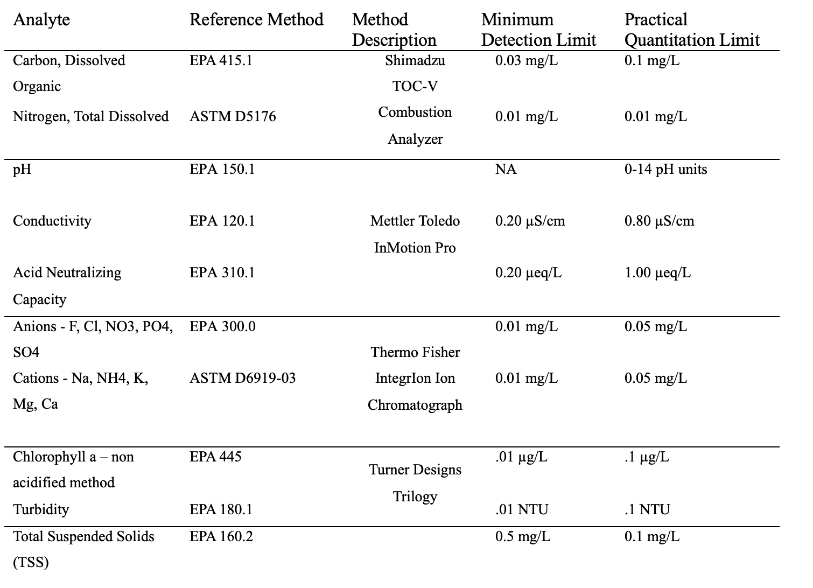

# CPF Reservoir Study Data

Authors: Samuel Struthers (<https://orcid.org/0000-0003-1263-9525>), Matthew R.V. Ross (<https://orcid.org/0000-0001-9105-4255>), Timothy S. Fegel, Kathryn Willi (<https://orcid.org/0000-0001-7163-2206>), Charles C. Rhoades (<https://orcid.org/0000-0002-3336-2257>)

**Data Description:** This data is water chemistry grab sample data collected post-Cameron Peak Fire in the Cache La Poudre Watershed between the years of 2021 and 2023. This data is focused on basic water quality parameters, as well as cations and anions. This data was collected at various reservoirs in the Cache La Poudre watershed as well as the mainstem of the Cache La Poudre River. This project is ongoing and additional data will be released in future versions. Historical data (prior to 2021) was collected by the Rhoades Lab at the USFS' Rocky Mountain Research Station.

**Background Information:** The 2020 Cameron Peak wildfire (CPF) was the largest wildfire in Colorado history at over 200,000 acres. The CPF burned a large proportion of the Cache La Poudre watershed, in particular various high elevation reservoirs. These reservoirs provide valuable drinking and agriculutural water to users in the City of Fort Collins, Greeley, Thornton and Northern Water. In collaboration with the Rocky Mountain Research Station (USFS, RMRS), we are sampling various reservoir, tributary, and mainstem sites of the Cache La Poudre watershed. This field campaign allows us to analyze trends in water quality focusing on nutrients and other key constituents mobilized post-fire. The goal of this project is to understand how these nutrients affect algal growth in reservoirs and how those changes are felt downstream. The reservoirs studied are the following: Barnes Meadow Reservoir, Chambers Lake, Comanche Reservoir, Hourglass Reservoir, Joe Wright Reservoir, Long Draw Reservoir, Peterson Lake. Mainstem locations were established as a part of the Upper Cache la Poudre Collaborative Water Quality Monitoring Program by the Cities of Fort Collins, Greeley and the Soldier Canyon Water Treatment Authority. 

**Methodology:** This repository currently primarily contains water sample data but also contains some code to merge chemistry data measured in the lab with location, burn severity and extent metadata added by ROSSyndicate.

Code is housed in the scripts folder and contains the following:

-   00_colors_and_groups.R provides groupings and colors for plots created in future analysis.

-   01_chem_prep.qmd adds metadata to most recent csv of water chemistry data supplied by RMRS lab.

-   distance_finder.R uses NHDflowlines to calculate distances from furthest downstream site, PBD.

Data is housed in the data folder and contains the following:

-   cleaned: This data has been passed through the 01_chem_prep scripted and has all associated burn severity and location data.

-   raw: This data was directly received from RMRS lab managers

-   metadata: this contains location data as well as units for the parameters listed. This also contains the lab methods used at the RMRS Lab.

Samples were collected and processed using the Rocky Mountain Research Station's Biogeochemistry Lab, overseen by Timothy Fegel and Charles Rhoades, according to the following methods:

**Funding:** This project was funded by the City of Fort Collins Utilities, City of Greeley Utilities, City of Thornton Utilities and Northern Water.

**Keywords**: Cameron Peak Fire, water quality, reservoirs, chlorophyll a, biogeochemistry

**Version**: v2023.08.07
